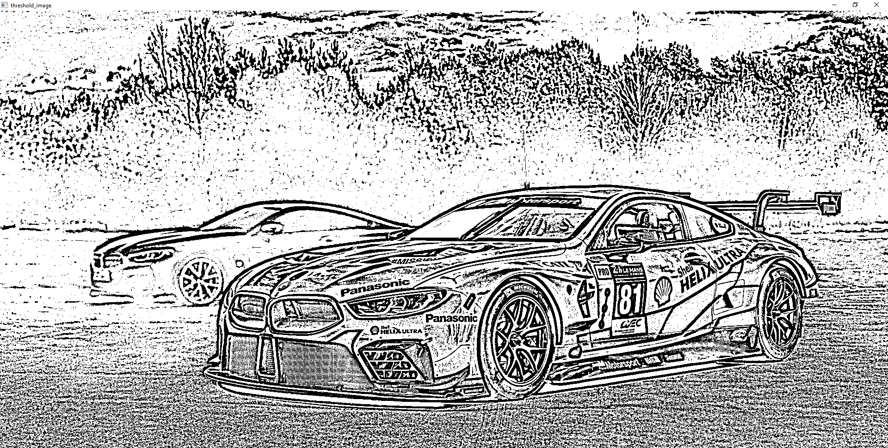

# Thresholding of Images
## Aim
To segment the image using global thresholding, adaptive thresholding and Otsu's thresholding using python and OpenCV.

## Software Required
1. Anaconda - Python 3.7
2. OpenCV

# Algorithm
## Step1:
Import necessary packages

## Step2:
Read the image

## Step3:
If the read image is color image, convert it into grayscale image

## Step4:
perform the threshold operation you want to do(global thresholding or adaptive thresholding or otsu's thresholding)

## Step5:
Display the Resulte


# Program:

```
DEVELOPED BY : KRISHNA PRAKAASH D M
REG NO: 212221230052
```

```
# Load the necessary packages

import cv2

# Read the Image , show it and convert to grayscale , show it

img = cv2.imread('CAR.jpg',-1)
cv2.imshow('original_image',img)
cv2.waitKey(0)
cv2.destroyAllWindows

gray =cv2.cvtColor(img,cv2.COLOR_BGR2GRAY)
cv2.imshow('gray_image',gray)
cv2.waitKey(0)
cv2.destroyAllWindows

# Use Global thresholding to segment the image

ret,thresh_img1=cv2.threshold(gray,86,255,cv2.THRESH_BINARY)

ret,thresh_img2=cv2.threshold(gray,86,255,cv2.THRESH_BINARY_INV)

ret,thresh_img3=cv2.threshold(gray,86,255,cv2.THRESH_TOZERO)

ret,thresh_img4=cv2.threshold(gray,86,255,cv2.THRESH_TOZERO_INV)

ret,thresh_img5=cv2.threshold(gray,100,255,cv2.THRESH_TRUNC)


# Use Adaptive thresholding to segment the image

thresh_img6=cv2.adaptiveThreshold(gray,255,cv2.ADAPTIVE_THRESH_MEAN_C,cv2.THRESH_BINARY,11,2)

thresh_img7=cv2.adaptiveThreshold(gray,255,cv2.ADAPTIVE_THRESH_GAUSSIAN_C,cv2.THRESH_BINARY,11,2)


# Use Otsu's method to segment the image 
ret,thresh_img8=cv2.threshold(gray,0,255,cv2.THRESH_BINARY+cv2.THRESH_OTSU)


# Display the results

image = [thresh_img1,thresh_img2,thresh_img3,thresh_img4,thresh_img5,thresh_img6,thresh_img7,thresh_img8]
for i in range(0,8):
    cv2.imshow('threshold_image',image[i])
    cv2.waitKey(0)
    cv2.destroyAllWindows

```


# Output

## Original Image and GRAY IMAGE


## Global Thresholding


## Adaptive Thresholding



## Optimum Global Thesholding using Otsu's Method


## Result
Thus the images are segmented using global thresholding, adaptive thresholding and optimum global thresholding using python and OpenCV.

